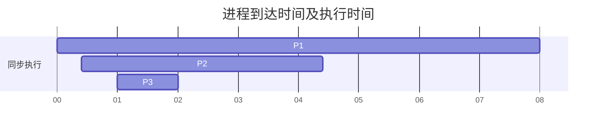
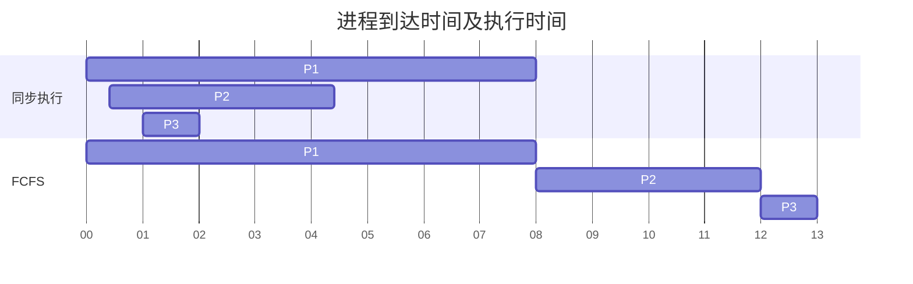
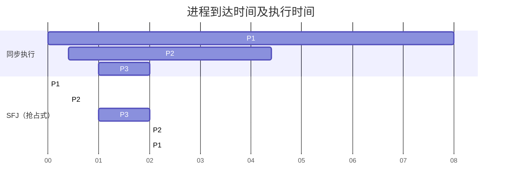
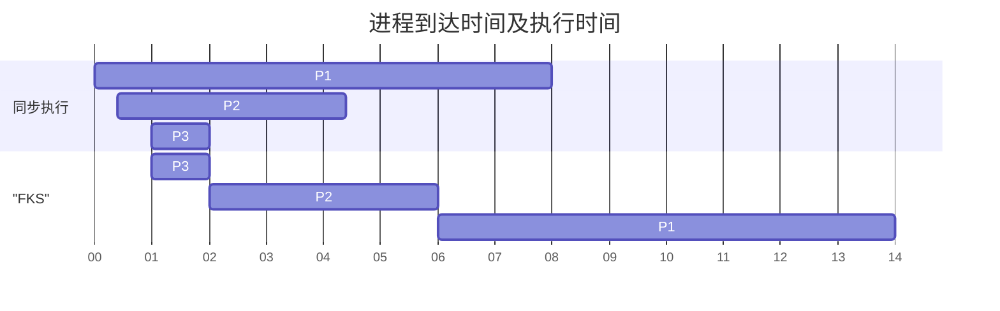
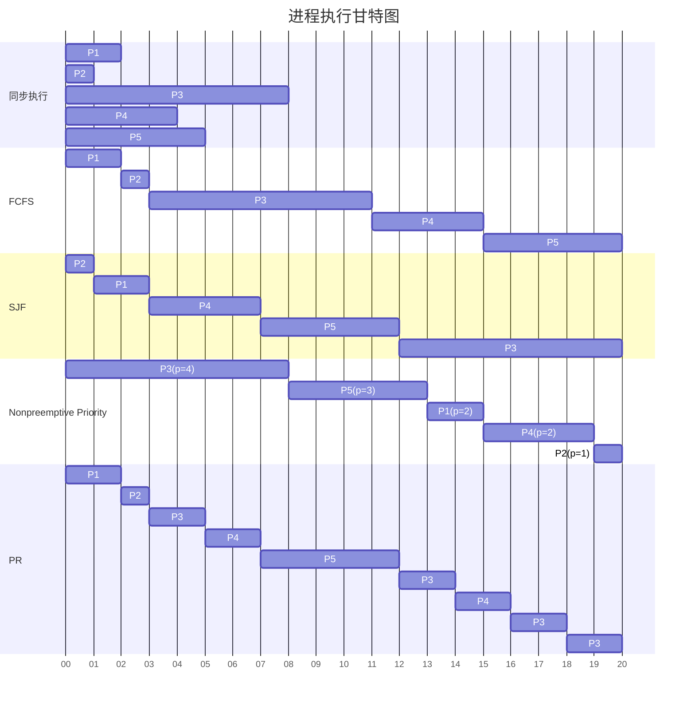
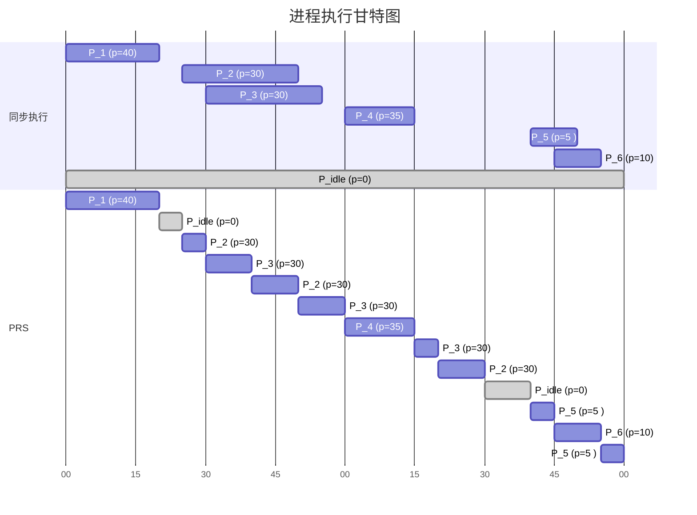

#! https://zhuanlan.zhihu.com/p/424667500

# 【操作系统概念-作业6】CPU Scheduling

# *Operating System Concepts* Exercises 6

CPU Scheduling

操作系统作业6

* 6.2, 6.3, 6.6, 6.9
* 6.10, 6.13, 6.16, 6.17, 6.19, 6.21, 6.23, 6.28

<!--more-->

## Practice Exercises

6.2, 6.3, 6.6, 6.9

### 6.2 Explain the difference between preemptive and nonpreemptive scheduling.

解释一下抢占式调度和非抢占式调度的区别。

**答：** 

教材P263

>CPU-scheduling decisions may take place under the following four circumstances:
>
>1. When a process switches from the running state to the waiting state (for
>   example, as the result of an I/O request or an invocation of wait() for
>   the termination of a child process)
>2. When a process switches from the running state to the ready state (for example, when an interrupt occurs) 
>3. When a process switches from the waiting state to the ready state (for example, at completion of I/O) 
>4. When a process terminates
>
>For situations 1 and 4, there is no choice in terms of scheduling. A new process (if one exists in the ready queue) must be selected for execution. There is a choice, however, for situations 2 and 3. When scheduling takes place only under circumstances 1 and 4, we say that the scheduling scheme is nonpreemptive or cooperative. Otherwise, it is preemptive. Under nonpreemptive scheduling, once the CPU has been allocated to a process, the process keeps the CPU until it releases the CPU either by terminating or by switching to the waiting state.

> **Answer:**
>
> Preemptive scheduling allows a process to be interrupted in the midst of its execution, taking the CPU away and allocating it to another process. Nonpreemptive scheduling ensures that a process relinquishes control of the CPU only when it finishes with its current CPU burst.
>
> Understanding four conditions under which CPU scheduling decisions take place.
>
> 抢占式调度允许一个进程在其执行过程中被打断，带走CPU并将其分配给另一个进程。非抢占式调度确保一个进程只有在完成其当前的CPU突发时才放弃对CPU的控制。
>
> 了解CPU调度决策发生的四个条件。

### 6.3 Suppose that the following processes arrive for execution at the times indicated. Each process will run for the amount of time listed. In answering the questions, use nonpreemptive scheduling, and base all decisions on the information you have at the time the decision must be made.

假设以下进程在指定的时间到达执行。每个进程将运行一定的时间。在回答这些问题时，请使用非抢占式调度，并将所有的决定建立在你必须做出决定时的信息上。

| Process | Arrival Time | Burst Time |
| ------- | ------------ | ---------- |
| $P_1$   | 0.0          | 8          |
| $P_2$   | 0.4          | 4          |
| $P_3$   | 1.0          | 1          |

#### a. What is the average turnaround time for these processes with the FCFS scheduling algorithm? 

在FCFS调度算法下，这些进程的平均周转时间是多少？

**答：**

平均等待时间：
$$
\frac{0+(12-4.4)+(13-2)}{3}=6.2
$$

平均周转时间：

$$
\frac{8+(12-0.4)+(13-1)}{3}=10.533333...
$$

#### b. What is the average turnaround time for these processes with the SJF scheduling algorithm? 

在SJF调度算法下，这些进程的平均周转时间是多少？

**答：**

抢占式的SJF：（最短剩余时间有限 SRTN ）

平均等待时间：
$$
\frac{(13-8)+(5-4.4)+(0)}{3}=1.8666666...
$$

平均周转时间：

$$
\frac{13+(5-0.4)+(2-1)}{3}=6.2
$$

*答案中所提供的是非抢占式的SJF。*

#### c. The SJF algorithm is supposed to improve performance, but notice that we chose to run process P1 at time 0 because we did not know that two shorter processes would arrive soon. Compute what the average turnaround time will be if the CPU is left idle for the first 1 unit and then SJF scheduling is used. Remember that processes P1 and P2 are waiting during this idle time, so their waiting time may increase. This algorithm could be called future-knowledge scheduling. 

SJF算法应该是为了提高性能，但是注意到我们选择在时间0运行进程P1，因为我们不知道两个较短的进程会很快到达。计算一下如果CPU在最初的1个单元中处于空闲状态，然后使用SJF调度，平均周转时间将是多少。记住，进程P1和P2在这段空闲时间内正在等待，所以他们的等待时间可能会增加。这种算法可以称为未来知识调度。

**答：**

平均等待时间：
$$
\frac{(0)+(6-4.4)+(14-8)}{3}=2.5333333...
$$

平均周转时间：

$$
\frac{(14-0)+(6-0.4)+(2-1)}{3}=6.8666666...
$$

> **Answer:**
>
> a.  10.53
>
> b.  9.53
>
> c.  6.86
>
> Remember that turnaround time is finishing time minus arrival time, so you have to subtract the arrival times to compute the turnaround times.
>
> 

### 6.6 Suppose that a scheduling algorithm (at the level of short-term CPU scheduling) favors those processes that have used the least processor time in the recent past. Why will this algorithm favor I/O-bound programs and yet not permanently starve CPU-bound programs?

假设一个调度算法（在短期CPU调度的层面上）偏向于那些在最近使用最少处理器时间的进程。为什么这个算法会偏向于I/O绑定的程序，却不会让CPU绑定的程序长期处于饥饿状态？

**答：**

I/O-bound programs 一般CPU时间较短，所以先执行，且因为其执行速度快，很快将执行完再执行CPU-bound programs。Like SJF.

> **Answer:**
>
> It will favor the I/O-bound programs because of the relatively short CPU burst request by them; however, the CPU-bound programs will not starve because the I/O-bound programs will relinquish the CPU relatively often to do their I/O.
>
> 这将有利于绑定I/O的程序，因为它们要求的CPU突发时间相对较短；然而，绑定CPU的程序不会挨饿，因为绑定I/O的程序会相对频繁地放弃CPU来做他们的I/O。

### 6.9 The traditional UNIX scheduler enforces an inverse relationship between priority numbers and priorities: the higher the number, the lower the priority. The scheduler recalculates process priorities once per second using the following function: 

传统的UNIX调度程序在优先级数字和优先级之间执行一种相反的关系：数字越大，优先级越低。调度器使用以下函数每秒钟重新计算一次进程的优先级:

`Priority = (recent CPU usage / 2) + base` 

where base = 60 and *recent CPU usage* refers to a value indicating how often a process has used the CPU since priorities were last recalculated. 

其中 base=60，*recent CPU usage*指的是一个值，表示自从上次重新计算优先级以来，一个进程使用CPU的频率。

Assume that recent CPU usage is 40 for process P1, 18 for process P2, and 10 for process P3. What will be the new priorities for these three processes when priorities are recalculated? Based on this information, does the traditional UNIX scheduler raise or lower the relative priority of a CPU-bound process?

假设进程P1最近的CPU使用率为40，进程P2为18，进程P3为10。当优先级被重新计算时，这三个进程的新优先级将是什么？基于这些信息，传统的UNIX调度程序是提高还是降低一个 CPU-bound进程的相对优先级？

**答：**
$$
P_1=\frac{40}{2}+60=80
\\
P_2=\frac{18}{2}+60=69
\\
P_3=\frac{10}{2}+60=65
$$
Will lower the relative priority of a CPU-bound process.

> **Answer:**
>
> The priorities assigned to the processes are 80, 69, and 65 respectively. The scheduler lowers the relative priority of CPU-bound processes.

## Exercises

6.10, 6.13, 6.16, 6.17, 6.19, 6.21, 6.23, 6.28

### 6.10 Why is it important for the scheduler to distinguish I/O-bound programs from CPU-bound programs?

为什么对调度员来说，区分绑定I/O的程序和绑定CPU的程序很重要？

**答：**Because 这两种类型的程序 have huge difference.

> **Answer:**
>
> I/O-bound programs have the property of performing only a small amount of computation before performing I/O. Such programs **typically do not use up their entire CPU quantum**. 
>
> CPU-bound programs, on the other hand, use their entire quantum without performing any blocking I/O operations. 
>
> Consequently, one could make better use of the computer’s resources (**CPU and I/O devices**) by giving higher priority to I/O-bound programs and allow them to execute ahead of the CPU-bound programs.
>
> I/O绑定的程序具有在执行I/O之前只进行少量计算的特性。这样的程序**通常不会用尽其整个CPU quantum**。
>
> 而另一方面，受CPU约束的程序在不执行任何阻塞性I/O操作的情况下使用其整个CPU quantum。
>
> 因此，人们可以通过给绑定I/O的程序以更高的优先级，让它们在绑定CPU的程序之前执行，从而更好地利用计算机的资源（**CPU和I/O设备**）。

### 6.13  In Chapter 5, we discussed possible race conditions on various kernel data structures. Most scheduling algorithms maintain a *run queue*, which lists processes eligible to run on a processor. On multicore systems, there are two general options: (1) each processing core has its own run queue, or (2) a single run queue is shared by all processing cores. What are the advantages and disadvantages of each of these approaches?

在第五章中，我们讨论了各种内核数据结构上可能存在的竞赛条件。大多数调度算法保持一个*运行队列*，它列出了有资格在处理器上运行的进程。在多核系统中，一般有两种选择。1）每个处理核心有自己的运行队列，或者2）所有处理核心共享一个运行队列。这些方法各自的优缺点是什么？

**答：**

#### (1) each processing core has its own run queue.

优点：不易冲突

缺点：管理不便

#### (2) a single run queue is shared by all processing cores.

优点：管理方便

缺点：同步麻烦，可能会出现冲突

> **Answer:**
>
> The primary advantage of each processing core having its own run queue is that there is no contention over a single run queue when the scheduler is running concurrently on 2 or more processors. When a scheduling decision must be made for a processing core, the scheduler only need to look no further than its private run queue. 
>
> A disadvantage of a single shared run queue is that it must be protected with locks to prevent a race condition and a processing core may be available to run a thread, yet it must first acquire the lock to retrieve the thread from the single queue. However, load balancing would likely not be an issue with a single run queue, whereas when each processing core has its own run queue, there must be some sort of load balancing between the different run queues.
>
> 每个处理核心都有自己的运行队列的主要优点是，当调度器在2个或更多的处理器上同时运行时，不会出现对单一运行队列的争夺。当必须为一个处理核心做出调度决定时，调度器只需要在其私有的运行队列中寻找。
>
> 单一共享运行队列的缺点是，它必须用锁来保护，以防止出现竞赛条件，一个处理核心可能可以运行一个线程，但它必须首先获得锁，才能从单一队列中检索到线程。然而，对于单个运行队列来说，负载平衡可能不是一个问题，而当每个处理核心有自己的运行队列时，不同的运行队列之间必须有某种负载平衡。

### 6.16  Consider the following set of processes, with the length of the CPU burst given in milliseconds:

考虑以下一组进程， CPU burst 的长度以毫秒为单位。

| Process | Burst Time | Priority |
| ------- | ---------- | -------- |
| $P_1$   | 2          | 2        |
| $P_2$   | 1          | 1        |
| $P_3$   | 8          | 4        |
| $P_4$   | 4          | 2        |
| $P_5$   | 5          | 3        |

The processes are assumed to have arrived in the order P1, P2, P3, P4, P5, all at time 0. 假设这些过程以P1, P2, P3, P4, P5的顺序到达在时间0。

#### a. Draw four Gantt charts that illustrate the execution of these processes using the following scheduling algorithms: FCFS, SJF, nonpreemptive priority (a larger priority number implies a higher priority), and RR (quantum = 2). 

画出四张甘特图，说明这些进程使用下列调度算法的执行情况。FCFS，SJF，非抢占优先权（较大的优先级数字意味着较高的优先级），以及RR（quantum = 2）。

#### b. What is the turnaround time of each process for each of the scheduling algorithms in part a? 

对于a部分中的每种调度算法，每个流程的周转时间是多少？

**答：**略，按之前题目的公式计算

#### c. What is the waiting time of each process for each of these scheduling algorithms? 

在这些调度算法中，每个进程的等待时间是多少？

**答：**略，按之前题目的公式计算

#### d. Which of the algorithms results in the minimum average waiting time (over all processes)? 

哪种算法能使平均等待时间最小（在所有进程中）？

> **Answer:**
>
> 
>
> 
>
> 
>
> d. Shortest Job First.

### 6.17 

The following processes are being scheduled using a preemptive, roundrobin scheduling algorithm. Each process is assigned a numerical priority, with a higher number indicating a higher relative priority. In addition to the processes listed below, the system also has an *idlet task* (which consumes no CPU resources and is identified as $P_{idle}$). This task has priority 0 and is scheduled whenever the system has no other available processes to run. The length of a time quantum is 10 units. If a process is preempted by a higher-priority process, the preempted process is placed at the end of the queue.

下面的进程正在使用一个抢占式的轮流调度算法进行调度。每个进程都被分配了一个数字的优先级，数字越大表示相对优先级越高。除了下面列出的进程，系统还有一个*idlet任务*（它不消耗CPU资源，被标识为$P_{idle}$）。这个任务的优先级为0，只要系统没有其他可用的进程可以运行，它就会被安排。一个时间量子的长度是10个单位。如果一个进程被更高优先级的进程抢占，被抢占的进程将被放在队列的最后。

| Process | Priority | Burst | Arrival |
| ------- | -------- | ----- | ------- |
| $P_1$   | 40       | 20    | 0       |
| $P_2$   | 30       | 25    | 25      |
| $P_3$   | 30       | 25    | 30      |
| $P_4$   | 35       | 15    | 60      |
| $P_5$   | 5        | 10    | 100     |
| $P_6$   | 10       | 10    | 105     |

#### a. Show the scheduling order of the processes using a Gantt chart. 

用甘特图显示流程的调度顺序。

**答：**

#### b. What is the turnaround time for each process?

每个过程的周转时间是多少？ 

**答：**略，按之前题目的公式计算

#### c. What is the waiting time for each process? 

每个程序的等待时间是多少？

**答：**略，按之前题目的公式计算

#### d. What is the CPU utilization rate?

CPU的利用率是多少？

> **Answer:**
>
> a. 
>
> 0-P1 
> 10-P1 
> 20-Pidle 
> 25-P2 
> 35-P3 
> 45-P2 
> 55-P3 
> 60-P4 
> 70-P4 
> 75-P2 
> 80-P3 
> 90-Pidle 
> 100-P5 
> 105-P6 
> 115-P5 
> 120- end 
>
> 
>
> 
>
> b. p1: 20-0 = 20, p2: 80-25 = 55, p3: 90 - 30 = 60, p4: 75-60 = 15, p5: 120-100 = 20, p6: 115-105 = 10
>
> c. p1: 0, p2: 40, p3: 35, p4: 0, p5: 10, p6: 0
>
> d. 105/120 = 87.5 percent.

### 6.19 Which of the following scheduling algorithms could result in starvation?

以下哪种调度算法可能导致饥饿？

- [ ] a. First-come, first-served 
- [x] b. Shortest job first 
- [ ] c. Round robin 
- [x] d. Priority

> **Answer:**
>
> Shortest job first and priority-based scheduling algorithms could result in starvation.

### 6.21 Consider a system running ten I/O-bound tasks and one CPU-bound task. Assume that the I/O-bound tasks issue an I/O operation once for every millisecond of CPU computing and that each I/O operation takes 10 milliseconds to complete. Also assume that the context-switching overhead is 0.1 millisecond and that all processes are long-running tasks. Describe the CPU utilization for a round-robin scheduler when:

考虑一个正在运行十个I/O-bound任务和一个CPU-bound任务的系统。假设I/O绑定的任务在CPU计算的每一毫秒发出一次I/O操作，每个I/O操作需要10毫秒才能完成。还假设上下文切换开销为0.1毫秒，所有进程都是长期运行的任务。描述一下轮回调度器的CPU利用率，当:

#### a. The time quantum is 1 millisecond 

#### b. The time quantum is 10 milliseconds

> **Answer:**
>
> a. The time quantum is 1 millisecond: Irrespective of which process is scheduled, the scheduler incurs a 0.1 millisecond context-switching cost for every context-switch. This results in a CPU utilization of 1/1.1 * 100 = 91%.
>
> b. The time quantum is 10 milliseconds: The I/O-bound tasks incur a context switch after using up only 1 millisecond of the time quantum. The time required to cycle through all the processes is therefore 10*1.1 + 10.1 (as each I/O-bound task executes for 1 millisecond and then incur the context switch task, whereas the CPU-bound task executes for 10 milliseconds before incurring a context switch). The CPU utilization is therefore 20/21.1 * 100 = 94%.
>
> 答案：
> a. 时间量子是1毫秒：无论哪个进程被调度，调度器对每个上下文切换都会产生0.1毫秒的上下文切换成本。这导致CPU利用率为1/1.1 * 100 = 91%。
> b. 时间量子是10毫秒。I/O绑定的任务在只用了1毫秒的时间量子后就会发生上下文切换。因此，所有进程循环所需的时间是10*1.1+10.1（因为每个I/O绑定的任务执行1毫秒，然后发生上下文切换任务，而CPU绑定的任务在发生上下文切换之前执行10毫秒）。因此，CPU的利用率是20/21.1 * 100 = 94%。

### 6.23 

Consider a preemptive priority scheduling algorithm based on dynamically changing priorities. Larger priority numbers imply higher priority. When a process is waiting for the CPU (in the ready queue, but not running), its priority changes at a rate $\alpha$. When it is running, its priority changes at a rate $\beta$. All processes are given a priority of 0 when they enter the ready queue. The parameters $\alpha$ and $\beta$ can be set to give many different scheduling algorithms.

考虑一种基于动态变化的优先级的抢占式优先级调度算法。较大的优先级数字意味着较高的优先级。当一个进程在等待CPU时（在准备队列中，但没有运行），它的优先级以$\alpha$的速度变化。当它正在运行时，它的优先级以$\beta$的速度变化。所有进程在进入就绪队列时都被赋予0的优先级。参数$\alpha$和$\beta$可以被设置为许多不同的调度算法。

#### a. What is the algorithm that results from $\beta$ > $\alpha$ > 0? 

**答：**等同于FCFS

#### b. What is the algorithm that results from $\alpha$ < $\beta$ < 0?

**答：**等同于LCFS

> **Answer:**
>
> First case is FCFS; second case is LIFO (last in, first out).

### 6.28 

Assume that two tasks A and B are running on a Linux system. The nice values of A and B are −5 and +5, respectively. Using the CFS scheduler as a guide, describe how the respective values of `vruntime` vary between the two processes given each of the following scenarios: 

假设有两个任务A和B在一个Linux系统上运行。A和B的 nice values 分别为-5和+5。以CFS调度器为指导，描述在以下每种情况下，两个进程的 "vruntime"值如何变化。

#### Both A and B are CPU-bound. 

#### A is I/O-bound, and B is CPU-bound. 

#### A is CPU-bound, and B is I/O-bound.

**答：**

> **Answer:**
>
> • Since A has a higher priority than B, vruntime will move more slowly for A than B. If both A and B are CPU-bound (that is they both use the CPU for as long as it is allocated to them), vruntime will generally be smaller for A than B, and hence A will have a greater priority to run over B.
>
> • In this situation, vruntime will be much smaller for A than B as (1) vruntime will move more slowly for A than B due to priority differences, and (2) Awill require less CPU-time as it is I/O-bound.
>
> • This situation is not as clear, and it is possible that B may end up running in favor of A as it will be using the processor less than A and in fact its value of vruntime may in fact be less than the value of vruntime for B.
>
> - 如果A和B都是CPU绑定的（也就是只要分配给他们的CPU，他们都会使用），那么A的vruntime通常会比B小，因此A会比B有更大的运行优先权。
>
> - 在这种情况下，A的vruntime将比B小得多，因为（1）由于优先级的不同，A的vruntime将比B移动得更慢，（2）Awill需要的CPU时间更少，因为它是I/O绑定的。
>
> - 这种情况并不明确，有可能B最终会有利于A的运行，因为它对处理器的使用比A少，事实上它的vruntime值可能事实上小于B的vruntime值。

---

**注：**

参考资料：

[1] [mermaid - Markdownish syntax for generating flowcharts, sequence diagrams, class diagrams, gantt charts and git graphs. (mermaid-js.github.io)](https://mermaid-js.github.io/mermaid/#/)

[2] Operating System Concepts – 9th Edition 及其答案