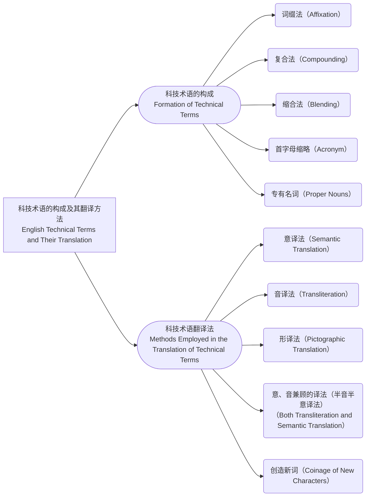

# 科技术语的构成及其翻译方法

*思维导图*

<!--more-->

```mermaid
graph LR
A["科技术语的构成及其翻译方法<br/>English Technical Terms and Their Translation"]
    A-->B1(["科技术语的构成<br/>Formation of Technical Terms"])
        B1-->C1("词缀法（Affixation）")
        B1-->C2("复合法（Compounding）")
        B1-->C3("缩合法（Blending）")
        B1-->C4("首字母缩略（Acronym）")
        B1-->C5("专有名词（Proper Nouns）")
    A-->B2(["科技术语翻译法<br/>Methods Employed in the Translation of Technical Terms"])
        B2-->D1("意译法（Semantic Translation）")
        B2-->D2("音译法（Transliteration）")
        B2-->D3("形译法（Pictographic Translation）")
        B2-->D4("意、音兼顾的译法（半音半意译法）<br/>（Both Transliteration and Semantic Translation）")
        B2-->D5("创造新词（Coinage of New Characters）")
```

